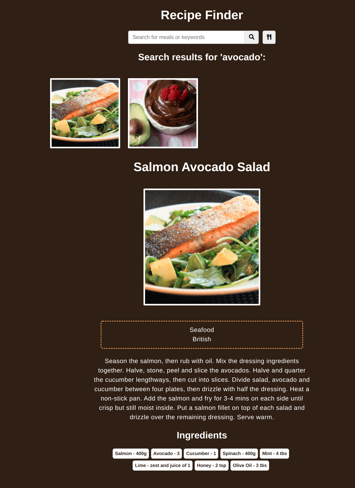

# recipe-finder

A simple Recipe Finder app that fetch recipes from a [third-party api](https://themealdb.com/api.php), using vanilla JavaScript

### Functions:

[The app](https://tn-space.github.io/recipe-finder/)

User must enter a keyword or search term in order for the app to retreat related recipes.

The app:

- fetches a random recipe from the API
- shows the name of recipe upon cursor hovering recipe thumbnail
- displays directions, and ingredient list upon clicking on a recipe thumbnail

### Images:

